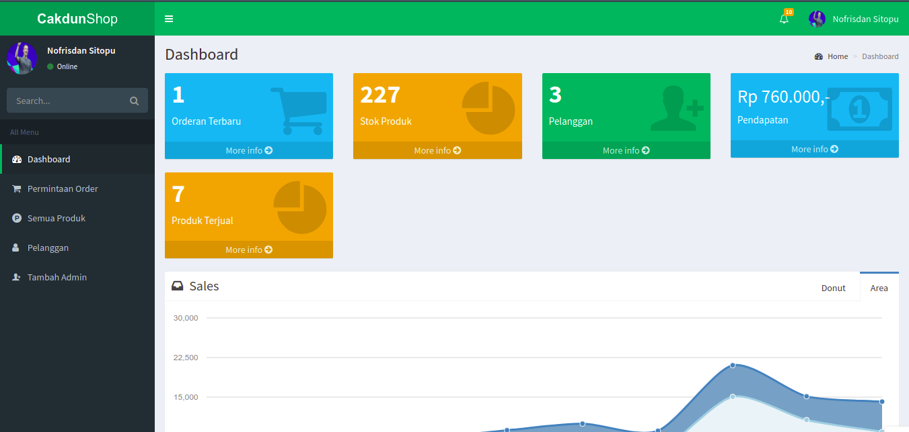

# Aplikasi Toko Online Berbasis Website

## Tentang Aplikasi

Aplikasi Toko Online Berbasis Website ini dibangun menggunakan bahasa pemrograman Php dan Javascript, yang di mana aplikasi ini ditujukan untuk mempercepat proses transaski antara penjual dan pembeli, dan selain itu juga aplikasi ini berfungsi untuk mempercepat proses pendataan produk beserta laporan pendapatan

## Fitur Yang digunakan

- Codeigniter 4
- Boostrap 3.3.7
- Admin Lte
- MySql

## User Interface

### Mobile Version
- User

### Web Version

## Copyright
Jika anda ingin menggunakan aplikasi ini silahkan menghubungi saya terlebih dahulu di <strong>nofrisdansitopu22@gmail.com</strong> dan terterakan copyright @nofrisdan
